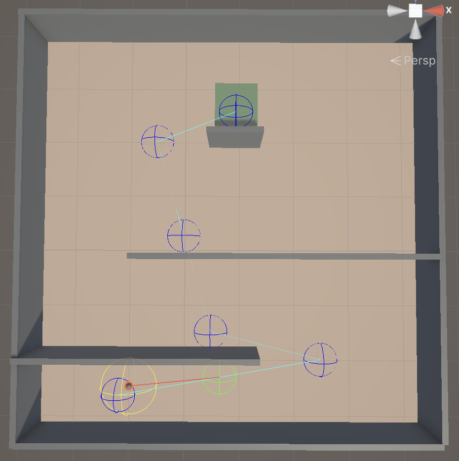

# MSC Dissertation: Path planning using Genetic Algorithms and Artificial Potential Fields in Dynamic Environments

## Contents
[Demonstration](https://github.com/MukulNarwani/MScProjectPosterPresentation/blob/main/README.md#L30)

## Video Demonstrations

### No clustering

### Genotype clustering

### Phenotype clustering

---

## Figures

---
## References

[TODO make using pandoc and actions]

Abdalla, Turki Y., et al. “Mobile Robot Navigation Using PSO-Optimized Fuzzy Artificial Potential Field with Fuzzy Control.” Journal of Intelligent & Fuzzy Systems, vol. 32, no. 6, May 2017, pp. 3893–908. SAGE Journals, https://doi.org/10.3233/IFS-162205.

Alabbadi, Areej, and Awos Kanan. “Genetic Algorithm-Based Path Planning for Autonomous Mobile Robots.” 2023 IEEE Jordan International Joint Conference on Electrical Engineering and Information Technology (JEEIT), 2023, pp. 177–80. IEEE Xplore, https://doi.org/10.1109/JEEIT58638.2023.10185855.

Das, Madhu Sudan, et al. “Navigation of Multiple Robots in Formative Manner in an Unknown Environment Using Artificial Potential Field Based Path Planning Algorithm.” Ain Shams Engineering Journal, vol. 13, no. 5, Sep. 2022, p. 101675. ScienceDirect, https://doi.org/10.1016/j.asej.2021.101675.

Elhoseny, Mohamed, et al. “Optimizing Robot Path in Dynamic Environments Using Genetic Algorithm and Bezier Curve.” Journal of Intelligent & Fuzzy Systems, vol. 33, no. 4, Oct. 2017, pp. 2305–16. SAGE Journals, https://doi.org/10.3233/JIFS-17348.

Fan, Xiaojing, et al. “Improved Artificial Potential Field Method Applied for AUV Path Planning.” Mathematical Problems in Engineering, vol. 2020, no. 1, 2020, p. 6523158. Wiley Online Library, https://doi.org/10.1155/2020/6523158.

Germi, Saeed Bakhshi, et al. “Adaptive GA-Based Potential Field Algorithm for Collision-Free Path Planning of Mobile Robots in Dynamic Environments.” 2018 6th RSI International Conference on Robotics and Mechatronics (IcRoM), 2018, pp. 28–33. IEEE Xplore, https://doi.org/10.1109/ICRoM.2018.8657601.

Hewawasam, H. S., et al. “Past, Present and Future of Path-Planning Algorithms for Mobile Robot Navigation in Dynamic Environments.” IEEE Open Journal of the Industrial Electronics Society, vol. 3, 2022, pp. 353–65. IEEE Xplore, https://doi.org/10.1109/OJIES.2022.3179617.

Hoseinnezhad, Reza. “A Comprehensive Review of Deep Learning Techniques in Mobile Robot Path Planning: Categorization and Analysis.” Applied Sciences, vol. 15, no. 4, 4, Jan. 2025, p. 2179. www.mdpi.com, https://doi.org/10.3390/app15042179.

Hu, Yanrong, and S. X. Yang. “A Knowledge Based Genetic Algorithm for Path Planning of a Mobile Robot.” IEEE International Conference on Robotics and Automation, 2004. Proceedings. ICRA ’04. 2004, vol. 5, 2004, pp. 4350-4355 Vol.5. IEEE Xplore, https://doi.org/10.1109/ROBOT.2004.1302402.

Katona, Kornél, et al. “Obstacle Avoidance and Path Planning Methods for Autonomous Navigation of Mobile Robot.” Sensors, vol. 24, no. 11, Jan. 2024, p. 3573. www.mdpi.com, https://doi.org/10.3390/s24113573.

Khatib, Oussama. “Real-Time Obstacle Avoidance for Manipulators and Mobile Robots.” The International Journal of Robotics Research, vol. 5, no. 1, Mar. 1986, pp. 90–98. SAGE Journals, https://doi.org/10.1177/027836498600500106.

Koren, Y., and J. Borenstein. “Potential Field Methods and Their Inherent Limitations for Mobile Robot Navigation.” 1991 IEEE International Conference on Robotics and Automation Proceedings, 1991, pp. 1398–404 vol.2. IEEE Xplore, https://doi.org/10.1109/ROBOT.1991.131810.

---. “Potential Field Methods and Their Inherent Limitations for Mobile Robot Navigation.” 1991 IEEE International Conference on Robotics and Automation Proceedings, 1991, pp. 1398–404 vol.2. IEEE Xplore, https://doi.org/10.1109/ROBOT.1991.131810.

Koryakovskiy, Ivan, et al. “A Genetic Algorithm with Local Map for Path Planning in Dynamic Environments.” Proceedings of the 11th Annual Conference on Genetic and Evolutionary Computation, Association for Computing Machinery, 2009, pp. 1859–60. ACM Digital Library, https://doi.org/10.1145/1569901.1570203.

Liao, Chenxi, et al. “GAA-DFQ: A Dual-Layer Learning Model for Robot Path Planning in Dynamic Environments Integrating Genetic Algorithms, DWA, Fuzzy Control and O-Learning.” 2025 8th International Conference on Advanced Algorithms and Control Engineering (ICAACE), 2025, pp. 339–43. IEEE Xplore, https://doi.org/10.1109/ICAACE65325.2025.11019886.

Liu, Feng, et al. “Improved Potential Field Method Path Planning Based on Genetic Algorithm.” 2020 39th Chinese Control Conference (CCC), 2020, pp. 3725–29. IEEE Xplore, https://doi.org/10.23919/CCC50068.2020.9189655.

Liu, Yanping, and Kamal K. Bharadwaj. “A Hybrid Artificial Potential Field: Genetic Algorithm Approach to Mobile Robot Path Planning in Dynamic Environments.” Computer Science and Convergence, edited by James J. (Jong Hyuk) Park et al., Springer Netherlands, 2012, pp. 325–33. Springer Link, https://doi.org/10.1007/978-94-007-2792-2_31.

Montiel, Oscar, et al. “Optimal Path Planning Generation for Mobile Robots Using Parallel Evolutionary Artificial Potential Field.” Journal of Intelligent & Robotic Systems, vol. 79, no. 2, Aug. 2015, pp. 237–57. Springer Link, https://doi.org/10.1007/s10846-014-0124-8.

Nazarahari, Milad, et al. “Multi-Objective Multi-Robot Path Planning in Continuous Environment Using an Enhanced Genetic Algorithm.” Expert Systems with Applications, vol. 115, Jan. 2019, pp. 106–20. ScienceDirect, https://doi.org/10.1016/j.eswa.2018.08.008.

Pehlivanoglu, Y. Volkan, and Perihan Pehlivanoglu. “An Enhanced Genetic Algorithm for Path Planning of Autonomous UAV in Target Coverage Problems.” Applied Soft Computing, vol. 112, Nov. 2021, p. 107796. ScienceDirect, https://doi.org/10.1016/j.asoc.2021.107796.

Pratihar, Dilip Kumar, et al. “A Genetic-Fuzzy Approach for Mobile Robot Navigation among Moving Obstacles.” International Journal of Approximate Reasoning, vol. 20, no. 2, Feb. 1999, pp. 145–72. ScienceDirect, https://doi.org/10.1016/S0888-613X(98)10026-9.

Saini, Amrita, et al. “A Hybrid APF Approach for Obstacle Avoidance in a 3D Environment.” 2025 3rd IEEE International Conference on Industrial Electronics: Developments & Applications (ICIDeA), 2025, pp. 1–6. IEEE Xplore, https://doi.org/10.1109/ICIDeA64800.2025.10963226.

Shiller, Zvi, et al. “Motion Planning in Dynamic Environments.” Autonomous Navigation in Dynamic Environments, edited by Christian Laugier and Raja Chatila, Springer, 2007, pp. 107–19. Springer Link, https://doi.org/10.1007/978-3-540-73422-2_5.

Tuncer, Adem, and Mehmet Yildirim. “Dynamic Path Planning of Mobile Robots with Improved Genetic Algorithm.” Computers & Electrical Engineering, vol. 38, no. 6, Nov. 2012, pp. 1564–72. ScienceDirect, https://doi.org/10.1016/j.compeleceng.2012.06.016.

Uçan, Ferhat, and D. Turgay Altılar. “Using Genetic Algorithms for Navigation Planning in Dynamic Environments.” Applied Computational Intelligence and Soft Computing, vol. 2012, no. 1, 2012, p. 560184. Wiley Online Library, https://doi.org/10.1155/2012/560184.

Ugwoke, Kenneth Christopher, et al. “Simulation-Based Review of Classical, Heuristic, and Metaheuristic Path Planning Algorithms.” Scientific Reports, vol. 15, no. 1, Apr. 2025, p. 12643. www.nature.com, https://doi.org/10.1038/s41598-025-96614-2.

Wang, Binyu, et al. Mobile Robot Path Planning in Dynamic Environments through Globally Guided Reinforcement Learning. arXiv:2005.05420, arXiv, 11 Sep. 2020. arXiv.org, https://doi.org/10.48550/arXiv.2005.05420.

Wu, Zhengtian, et al. “Robot Path Planning Based on Artificial Potential Field with Deterministic Annealing.” ISA Transactions, vol. 138, Jul. 2023, pp. 74–87. ScienceDirect, https://doi.org/10.1016/j.isatra.2023.02.018.

Yang, Liwei, et al. “Path Planning Technique for Mobile Robots: A Review.” Machines, vol. 11, no. 10, 10, Oct. 2023, p. 980. www.mdpi.com, https://doi.org/10.3390/machines11100980.

Yang, Yalian, et al. “AAPF*: A Safer Autonomous Vehicle Path Planning Algorithm Based on the Improved A* Algorithm and APF Algorithm.” Cluster Computing, vol. 27, no. 8, Nov. 2024, pp. 11393–406. Springer Link, https://doi.org/10.1007/s10586-024-04287-9.

Zhang, Kaihuai, et al. “A Real-Time RRT-APF Approach for Efficient Multi-Robot Navigation in Complex Environments.” 2025 IEEE International Conference on Industrial Technology (ICIT), 2025, pp. 1–6. IEEE Xplore, https://doi.org/10.1109/ICIT63637.2025.10965231.
